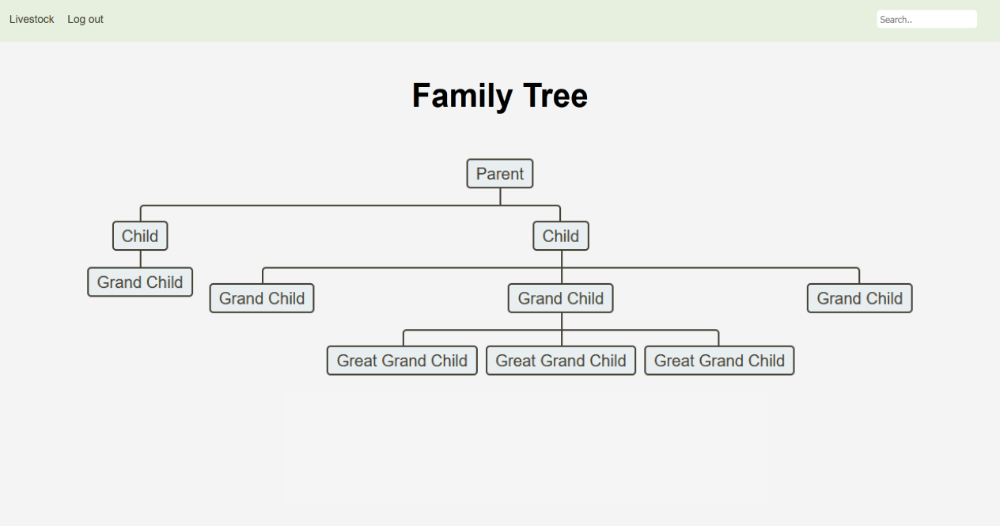

# Farmfolio


Farmfolio is a web application designed to assist in livestock inventory tracking. The application displays animal profiles, which can hold names, date of birth, vaccination records, and lineage and other user-defined parameters. Users are also able to view the family tree of a given animal, allowing for a quick visual representation of lineage.



For interested students to participate and for the farm to operate efficiently, their efforts need to be coordinated within one system. The client doesn’t have a system to track student progress,limiting his ability to provide feedback and students develop their skills. This lack of structure and feedback may discourage student participation or lead to unproductive outcomes

## Project Mission 

Most farmers around the world rely on old fashion methods of inventory keeping. These methods can be a written notebook or a memory based approach. This can be very inefficient and can result in loss of data that can negatively affect these farmers.

We plan on bringing these farmers a modernized inventory keeping application that efficiently stores and manipulates data at the farmers convenience. Not only will this application be easy to use, it will also be easy to scale as the farmers' businesses grow.

## Developer Notes

The application is built using an [ADR](https://github.com/pmjones/adr)  (Action-Domain-Responder) architectural pattern. Similar to an MVC pattern, the application is composed of three primary layers.

The Action, generally implemented as a closure wraps the whole runtime of a given request. Both the Domain and Responder layers will be initiated from a given Action.

The Domain layer of the application is composed of the "business application" section of the code. Any updates to the application itself will occurr within this layer. The Domain layer should not be concerned with the representation of HTTP Requests or Database operations.

The Responder layer should only be concerned with the packaging of a given HTTP response. The results of the business layer code will be passed into a given responder, forming the response sent to the client.

### Backend
```
// To compile
mnv package

// To run
java -jar target/iloveyou-0.0.1.jar
```
### Frontend
```
// Install Dependencies
npm install

// Start application
npm start
```

### Timeline 

**Sprint 5** - Finalize Backend API and ensure proper with Frontend
**Sprint 6** - Working, simple implementation of all Frontend functionality. UI styles not required.
**Sprint 7** - Complete Frontend UI
**Sprint 8** - Final touches with a created 1.0 release version. Setup application hosting.


