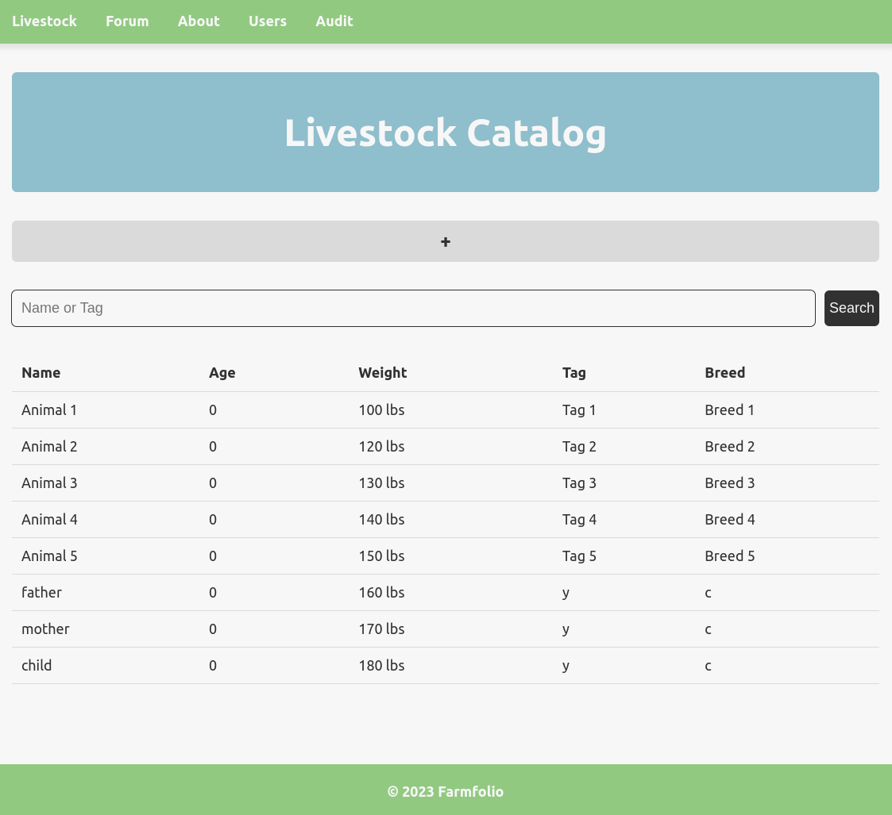
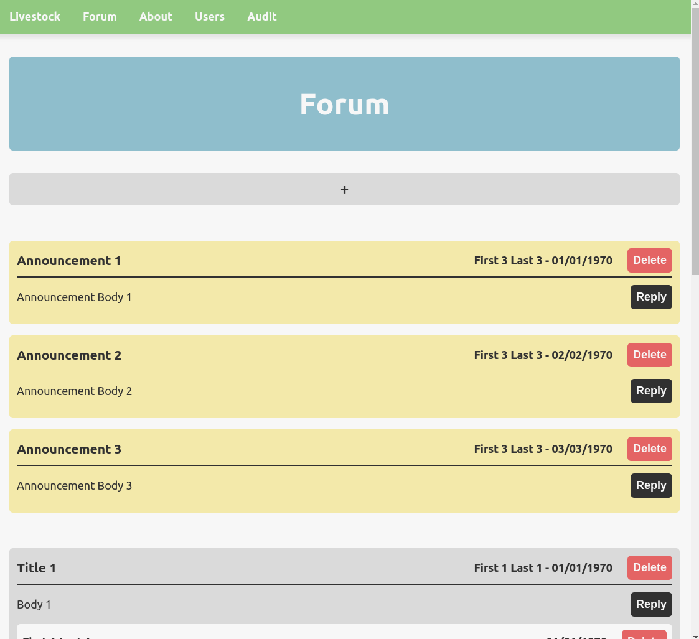

# Farmfolio


---

Farmfolio is a web application designed to assist in livestock inventory tracking. The application displays animal profiles, which can hold names, date of birth, lineage and various other parameters.



For interested students to participate and for the farm to operate efficiently, their efforts need to be coordinated within one system. In order to aid in this process, the application provides both a forum and an audit system to track changes. Since the client doesn’t currently have a system to track student progress, his ability to provide feedback and students to develop their skills is limited. This lack of structure and feedback may discourage student participation or lead to unproductive outcomes



## Project Mission 

Most farmers around the world rely on old fashion methods of inventory keeping. These methods can be a written notebook or a memory based approach. This can be very inefficient and can result in loss of data that can negatively affect these farmers.

We plan on bringing these farmers a modernized inventory keeping application that efficiently stores and manipulates data at the farmers convenience. Not only will this application be easy to use, it will also be easy to scale as the farmers' businesses grow.

## Developer Notes

The application is build using Spring and React. The frontend is a simple Single Page Application which targets the API provided the the Spring backend. The API itself was built using an MVC architectural pattern.

**Features**
- JWT Authentication
- H2 Embedded database
- Hibernate ORM/JPA
- 

### Backend
```
// To run
./mvnw spring-boot:run

// To test
./mvnw test
```
### Frontend
```
// Install Dependencies
npm install

// Start application
npm start
```

### Team

Michelle Li - [michelledli@csus.edu](mailto:michelledli@csus.edu)

Sahil Prasad - [sahilshanaveyprasad@csus.edu](mailto:sahilshanaveyprasad@csus.edu)

Niketa Kosyuk - [nkosyuk@csus.edu](mailto:nkosyuk@csus.edu)

Dat Mai - [datmai@csus.edu](mailto:datmai@csus.edu)

Javier Briseno - [javierbriseno@csus.edu](mailto:javierbriseno@csus.edu)

Jackson Martin - [jacksonmartin@csus.edu](mailto:jacksonmartin@csus.edu)

Linh Dinh - [ldinh@csus.edu](mailto:ldinh@csus.edu)

Ethan Werner - [ewerner@csus.edu](mailto:ewerner@csus.edu)


